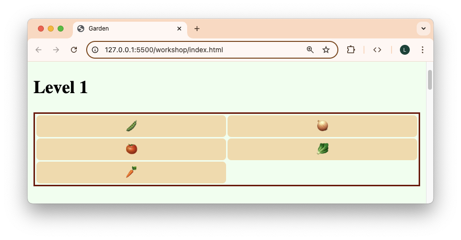
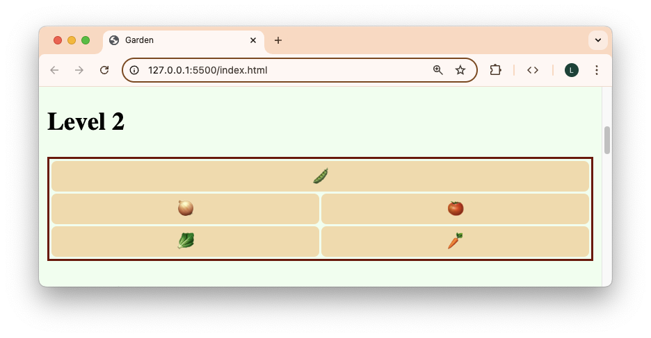
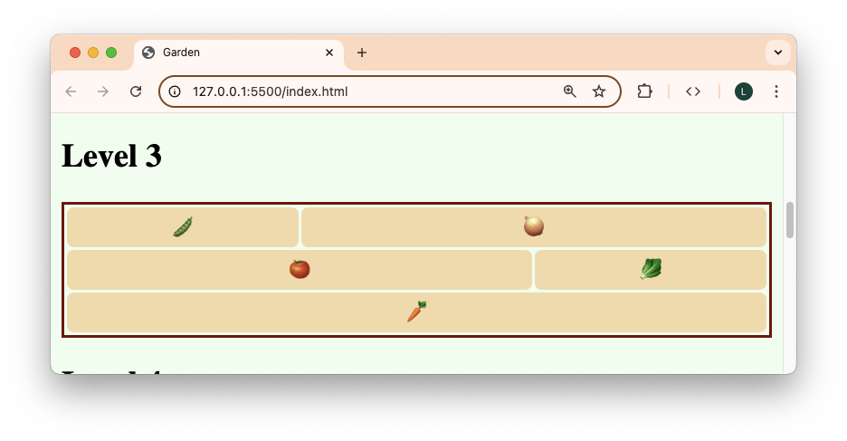
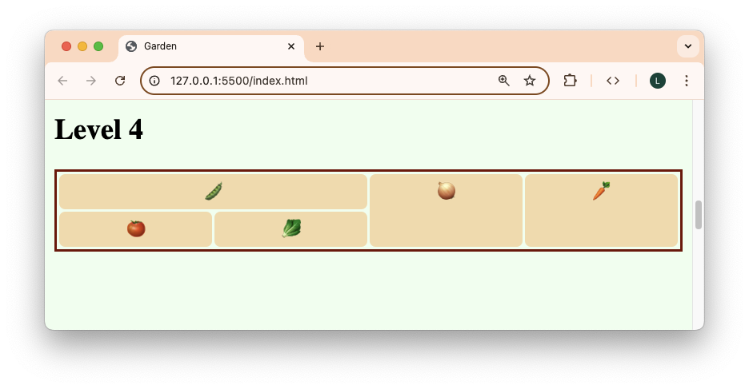
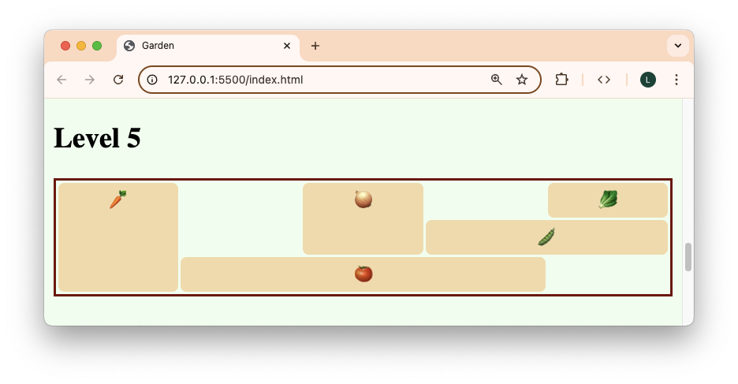
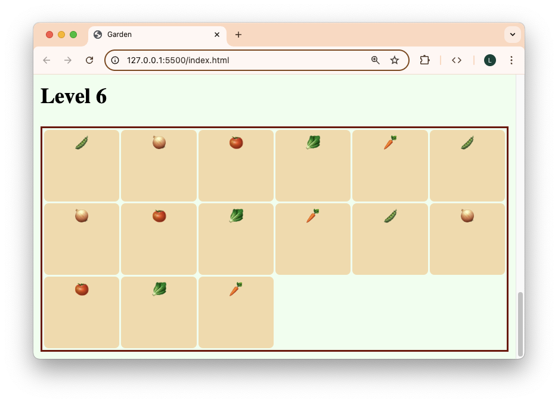

# Garden

Spring is approaching and some gardeners are discussing how they want to organize their plot this year. In this workshop, you'll be using grid to help them visualize increasingly persnickety garden designs!

## Getting Started

1. Create a new repository under your GitHub account using this one as a template.
2. Clone your repository down to your local machine.
3. Open the cloned folder with VS Code.
4. Live serve `index.html` to see the page that you will have to style.

## Instructions

1. Read through the code that has already been given to you in `index.html` and `index.css`.
2. Complete each level in the given order by writing CSS in `levels.css` to match the provided table. Each level is more difficult than the next. Make sure you are styling the grid container and grid items that correspond to the level!

## Levels

### Level 1

|     | 1        | 2       |
| --- | -------- | ------- |
| 1   | peas     | onions  |
| 2   | tomatoes | lettuce |
| 3   | carrots  |         |

### Level 2

|     | 1       | 2        |
| --- | ------- | -------- |
| 1   | peas    | peas     |
| 2   | onions  | tomatoes |
| 3   | lettuce | carrots  |

### Level 3

|     | 1        | 2        | 3       |
| --- | -------- | -------- | ------- |
| 1   | peas     | onions   | onions  |
| 2   | tomatoes | tomatoes | lettuce |
| 3   | carrots  | carrots  | carrots |

### Level 4

|     | 1        | 2       | 3      | 4       |
| --- | -------- | ------- | ------ | ------- |
| 1   | peas     | peas    | onions | carrots |
| 2   | tomatoes | lettuce | onions | carrots |

### Level 5

| | 1 | 2 | 3 | 4 | 5 |
|---|---------|----------|----------|----------|---------|
| 1 | carrots | | onions | | lettuce |
| 2 | carrots | | onions | peas | peas |
| 3 | carrots | tomatoes | tomatoes | tomatoes | |

### Level 6 (optional)

This level is a bit different. It would be very tedious to dictate where each of the many children would go. Instead, each row should fit as many plots as possible, as long as each plot is at least `5rem` wide. Within each row, each plot will take up 1 fraction of the available space, and will grow if there is room to grow. The grid will automatically make as many rows as needed to fit all of the plots given these constraints. The rows will be `5rem` high.

To accomplish this, you will need to independently research the following:

- [repeat](https://developer.mozilla.org/en-US/docs/Web/CSS/repeat)
- [repeat auto-fit](https://developer.mozilla.org/en-US/docs/Web/CSS/repeat#auto-fit)
- [minmax](https://developer.mozilla.org/en-US/docs/Web/CSS/minmax)
- [grid-auto-rows](https://developer.mozilla.org/en-US/docs/Web/CSS/grid-auto-rows)

Try your best!

## Submission

Please submit the link to your public GitHub repository.
